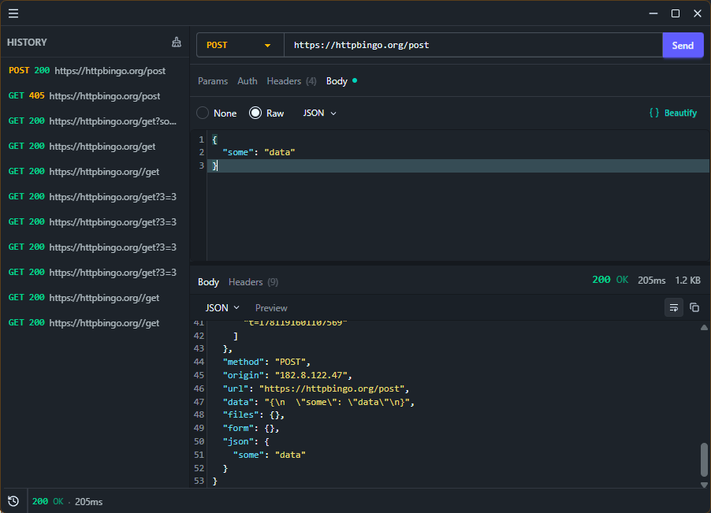

<h1 align="center">Beep</h1>
<p align="center">
    <em>Intuitive API Client</em>
</p>

<p align="center">
    Beep is a lightweight, cross-platform HTTP client for making API requests. Use it from the terminal or as a desktop app.
</p>

<p align="center">
  
</p>

## Features

### HTTP Request

Compose and send HTTP requests.

- **HTTP Methods** - All standard HTTP methods (GET, POST, PUT, DELETE, PATCH, HEAD, OPTIONS)
- **Authentication** - No Auth, Basic Auth & Bearer tokens
- **Headers & Query Params** - Full control over every request
- **Request Body Editor** - Edit request body with syntax highlighting
- **Request History** - [GUI] Automatically temporary history request
- **Response Viewer** - View response headers and body

### Coming soon

## Binary Releases

- **Desktop GUI** - Desktop app interface
- **TUI** - (TODO) Terminal interface
- **CLI** - Pipe-friendly, scriptable & direct
- **Cross-Platform** - Windows, (TODO) Linux, (TODO) macOS

## Usage

### Desktop GUI

Just run the desktop GUI based on your platform and start making requests.

### CLI

```bash
# Single URL defaults to GET
beep https://httpbingo.org/get

# Explicit method with URL
beep POST https://httpbingo.org/post -b '{"title":"Post"}'

# Headers and body can be placed anywhere
beep https://httpbingo.org/anything -H "Authorization: Bearer token"
beep PUT https://httpbingo.org/put -H "Content-Type: application/json" -b '{"key":"value"}'
```

| Argument       | Description                                       |
| -------------- | ------------------------------------------------- |
| `[METHOD]`     | HTTP method, Omit for GET                         |
| `<URL>`        | Request URL (required)                            |
| `-H, --header` | Request header in `key:value` format (repeatable) |
| `-b, --body`   | Request body                                      |

### TUI

TODO

## Download

> Pre-built binaries coming soon.

## Contributing

Contributions are welcome! Check the [Issues](https://github.com/raditzlawliet/beep/issues) page or open a Pull Request.

For build instructions, architecture details, and local development, see [DEVELOPMENT.md](DEVELOPMENT.md).

## License

AGPL-3.0
